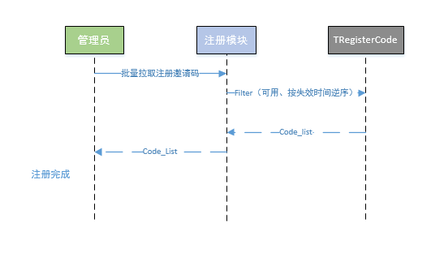
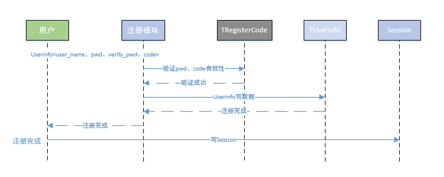
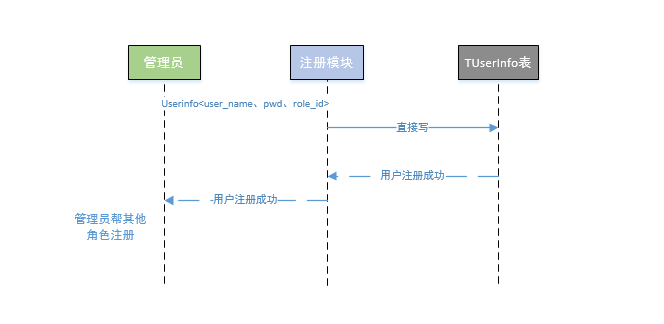
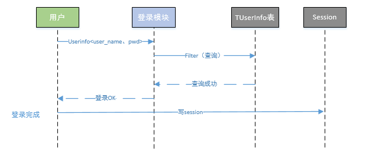

# 设计文档
> 标题可以用模块或者功能命名

时间|作者|备注
---|---|---
2016.10.17|uly|创建

[TOC]

## 一、背景介绍
> 描述该模块的产品背景，方便大家了解产品基础功能，不需要涉及到具体架构设计和实现细节。

优先完成如下页面以及后台功能
1、管理员用户后台离线生成
2、注册码后台离线生成
3、用户注册&登录模块
4、Session
5、管理员&非管理员登录成功页
6、退出登录

## 二、整体交互
> 描述该模块和其他模块之间的交互流程，有模块关系的话需要描述清楚，必要的时候附上系统架构图。

## 三、详细设计
> 描述该模块的详细设计，可以按照关键功能点或者技术点列举。如果有多个设计方案的话，也可以列出各种方案并比较优劣。这里的小点只是例子，可以按照模块的设计需求自己调整

### 1. 管理员用户后台离线生成
 后台脚本注册若干管理员用户，插入至TUserInfo表中
### 2. 注册码后台离线生成
 后台脚本生成一系列邀请注册码，具体实现可以为：
 code = sha1(timestamp+rand())
 数据生成后批量插入至TRegisterCode表
 提供接口给予管理员用于拉取可用的注册邀请码，流程为：
 

### 3. 用户注册&登录模块
1、普通客户经理用户注册输入暂定为(user_name,pwd,verify_pwd,register_code)
pwd的生成需要注意hash+加盐

2、管理员可以给其他身份（销售组长、销售部门经历）的角色注册帐号，输入暂定为userinfo(user_name、pwd、role_id)。
这里需要根据用户session中的role_id验证其身份，确认其确实为管理员才能继续后续的流程；

3、用户登录输入暂定为（user_name+pwd），对于session中有有效票据的认为拥有登录态依然有效
pwd的生成注意hash+加盐

### 4. Session
|列名|含义|类型|
|---|---|---|
|uid|用户id|int32_t|
|expired_time|登录态失效时间|timestamp|
|ticket|用户票据|string|
|role_id|角色id|int32_t|

1、session中的票据+uid需要一一对应，此处的对应关系可以在登录+注册时写入至TSessionInfo表中，如果嫌写存储以及校验麻烦，可以用简单的校验算法来搞定。
ticket=md5sum(uid+expired_time+role_id)

2、所有的请求处理接口中都需要校验session是否失效，一旦失效要跳转页面至登录页

（1）ticket是否等于md5sum(uid+expired_time+role_id)，如果不等于说明存在恶意篡改票据；
（2）expired_time是否失效
 ( 3 ) 页面访问权限 role_id对应角色，不同页面都有防问权限的判断，可以根据role_id获取到到其访问控制的权限参考7

### 5、管理员&非管理员登录成功页
  此处我们先实现管理员登录成功页，页面提供两个功能
  1、注册码拉取接口，在2中已经描述
  2、提供增加删除插件功能，插件表为TPluginInfo
  
### 6. 退出登录
	1、清除session
    2、跳转至登录页
    
### 7. flask启动初始化Init
    1、读TRoleInfo表，将所有的角色信息读至内存，可以存储为类似map<role_id, role_info>这样的数据，方便访问控制的判断
    2、读TUserInfo表，将所有的用户信息读至内存，可以存储为类似map<uid, user_info>这样的数据，方便登录时用户名密码的判断
    3、初始化日志对象，统一日志格式 [uid=xx][seq=xxx][model_name=xx]
    
## 四、存储设计
> 描述该模块使用的数据库存储详细结构，指明primary key。另外预估对数据库访问性能的压力。

### 1. 用户表TUserInfo
|列名|含义|primary key|类型|
|---|---|---|---|
|uid|用户id|是|int32_t|
|role_id|用户角色类型,1:admin 2:客户经理 3:销售组长 4：销售部门经理|-|int32_t|
|user_name|用户名称|-|string|
|login_time|上次登录时间|-|timestamp|
|register_time|用户注册时间|-|timestamp|
|pwd|用户密码，需要加盐 散列|-|string|

### 2. 角色表TRoleInfo
|列名|含义|primary key|类型|
|---|---|---|---|
|role_id|用户角色类型,1:admin 2:客户经理 3:销售组长 4：销售部门经理|是|int32_t|
|role_name|用户角色名称|-|string|
|right1|权限1:1表示拥有权限 0表示该角色不拥有该权限|-|int32_t|
|right2|权限2:1表示拥有权限 0表示该角色不拥有该权限|-|int32_t|
|right3|权限3:1表示拥有权限 0表示该角色不拥有该权限|-|int32_t|
|right4|权限4:1表示拥有权限 0表示该角色不拥有该权限|-|int32_t|

### 3. 注册码表TRegisterCode
|列名|含义|primary key|类型|
|---|---|---|---|
|id|注册码code id|是|int32_t 自增|
|code|注册码|-|string|
|valid_flag|有效性 1:有效 0:无效|-|int32_t|
|expired_time|失效时间|-|timestamp|

### 4. 插件表TPluginInfo
|列名|含义|primary key|类型|
|---|---|---|---|
|id|注册码code id|是|int32_t 自增|
|plugin_name|插件名称|-|string|
|plugin_icon|插件图标|-|string|

### 5. Session表TSessionInInfo --视情况后期再实现
|列名|含义|primary key|类型|
|---|---|---|---|
|id|注册码code id|是|int32_t 自增|
|plugin_name|插件名称|-|string|
|plugin_icon|插件图标|-|string|

